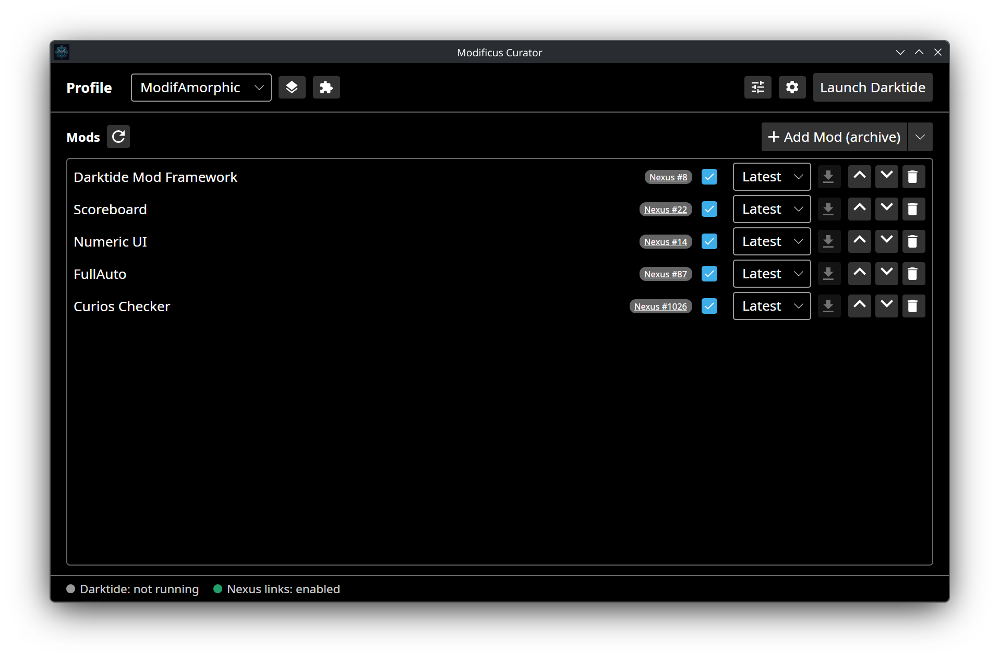

# Modificus Curator

<div align="center">
  
</div>

**Modificus Curator** is a mod manager for **Warhammer 40,000: Darktide**. It launches the
game modded via
[Modificus Relay](https://github.com/ModifAmorphic/darktide-modificus-relay) (DLL
injection: no files in the game directory, no bundle-database patching) and
stays out of the way for vanilla play (launch the game from Steam and it runs
unmodified).

<div align="center">
  
</div>

## Components

- **Modificus Curator** (this repo): the mod manager app (UI, staging, load order,
  profiles, dependency resolution, mod-source integrations). The backend
  libraries (Profiles, Mods, Steam, Integrations, Relay-client, General) and
  the UI (the app shell + profile management, global Preferences, the mod-list
  UI, the Launch flow + Settings window) are in place. The app is user-usable.
  On first startup a one-time Welcome window introduces Curator and offers to
  set up the Nexus integration. The Launcher is a stub. See
  [`src/README.md`](src/README.md) for developer/build
  details.
- **Modificus Relay** (separate repo):
  [darktide-modificus-relay](https://github.com/ModifAmorphic/darktide-modificus-relay): the
  injected modding runtime + its launcher (including the mod loader that loads
  DMF + user mods). Curator consumes its launcher.

## Status

Initial releases are published on the
[releases page](https://github.com/ModifAmorphic/darktide-modificus-curator/releases) and
are marked as prereleases while the release pipeline settles. To build from
source instead, see [`src/README.md`](src/README.md). The bundled runtime
artifacts (launcher, shell DLL, mod loader) come from the latest non-draft
[Modificus Relay](https://github.com/ModifAmorphic/darktide-modificus-relay)
prerelease available when the Curator release is built.

## Installation

### Windows

**Recommended:** Download `modificus-curator-setup.exe` from the
[latest release](https://github.com/ModifAmorphic/darktide-modificus-curator/releases).
Run it. It is a one-click installer (no wizard): it installs Curator into
`%LOCALAPPDATA%\ModifAmorphic.ModificusCurator\`, creates Start Menu and
desktop shortcuts, and registers in Apps & Features so you can uninstall it
the usual way. If the .NET 10 Runtime is missing, the installer downloads
and installs it for you.

**Portable (manual):** Download `curator-<tag>-windows-x64.zip` from the
[latest release](https://github.com/ModifAmorphic/darktide-modificus-curator/releases).
Extract it anywhere. The archive contains two top-level folders:

- `app/` - the Curator UI and the `nxm://` handler.
- `relay/` - the bundled Modificus Relay runtime.

Run `app/Modificus.Curator.exe`. The .NET 10 Runtime is required and must be
installed separately from <https://dotnet.microsoft.com/download/dotnet/10.0>.
Curator does not auto-update the portable build; download a newer ZIP manually
to update.

To enable Nexus "Download with manager" links, open **Integrations** (gear icon
next to the profiles button) and enable "Nexus download links". This registers
the `nxm://` handler so clicking a download link on the Nexus Mods website
opens Curator directly.

> The installer is not code-signed yet, so Windows SmartScreen may warn on the
> first run. Choose **More info** > **Run anyway** to continue.

Velopack-installed builds check for new versions on startup and can update
themselves in place. When one is available, a notice appears in the bottom
status strip and the **Settings** window's **Updates** section lets you download
and restart into the new version. This applies to the Windows installer and the
Linux AppImage. The portable Windows and standalone Linux builds do not support
in-app self-update.

### Linux (AppImage)

**Recommended:** The AppImage includes .NET 10, adds a desktop entry and icon,
and supports Curator's in-app Download and Restart updates.

Install the latest stable AppImage:

```sh
curl https://raw.githubusercontent.com/ModifAmorphic/darktide-modificus-curator/main/scripts/install.sh | sh
```

Install the latest prerelease AppImage:

```sh
curl https://raw.githubusercontent.com/ModifAmorphic/darktide-modificus-curator/main/scripts/install.sh | sh -s -- --prerelease
```

The installer resolves the AppImage from the release manifest without querying
the GitHub API. It installs a stable file at
`~/.local/share/Modificus Curator/appimage/Modificus.Curator.AppImage`, creates
`~/.local/bin/modificus-curator`, and installs user-level desktop integration.
It uses no root privileges and leaves profiles, mods, logs, config, app state,
and any standalone installation untouched.

To enable Nexus "Download with manager" links, open **Integrations** and enable
"Nexus download links". Curator copies its AppImage-packaged handler to a
durable per-user path so the registration survives AppImage unmounts and
updates.

Uninstall only the AppImage distribution while preserving profiles, mods,
config, logs, app state, and any standalone installation:

```sh
curl https://raw.githubusercontent.com/ModifAmorphic/darktide-modificus-curator/main/scripts/uninstall.sh | sh
```

The default uninstall also removes Curator's app-specific Velopack cache and
pending-update state. A local `AppUpdates.SourceOverride` in `config.json` is
preserved and must be cleared separately before testing production updates.

### Linux (Standalone)

The standalone tarball is a permanent alternative. It requires the **.NET 10
Runtime**, available from
<https://dotnet.microsoft.com/download/dotnet/10.0>, and updates by re-running
its installer.

Install the latest stable standalone release:

```sh
curl https://raw.githubusercontent.com/ModifAmorphic/darktide-modificus-curator/main/scripts/install-standalone.sh | sh
```

Install the latest prerelease standalone release:

```sh
curl https://raw.githubusercontent.com/ModifAmorphic/darktide-modificus-curator/main/scripts/install-standalone.sh | sh -s -- --prerelease
```

The standalone installer resolves the archive from the same release manifest,
replaces only `app/` and `relay/` under
`~/.local/share/Modificus Curator/`, and leaves user data untouched.

The Linux release archive contains two top-level folders:

- `app/` - the Curator UI, the `nxm://` handler, and the launcher stub.
- `relay/` - the bundled Modificus Relay runtime.

Extracting it into Curator's default data folder seeds both the app and the
default Relay location, so no extra configuration is needed.

Manual install:

1. Download `curator-<tag>-linux-x64.tar.gz` from the
   [latest release](https://github.com/ModifAmorphic/darktide-modificus-curator/releases).
2. Extract it into `~/.local/share/Modificus Curator/` (create the folder if it
   does not exist), for example:
   `tar -xzf curator-<tag>-linux-x64.tar.gz -C "$HOME/.local/share/Modificus Curator/"`.
3. Make the UI executable:
   `chmod +x "$HOME/.local/share/Modificus Curator/app/Modificus.Curator"`.
4. Optionally symlink it onto your PATH:
   `ln -sf "$HOME/.local/share/Modificus Curator/app/Modificus.Curator" "$HOME/.local/bin/modificus-curator"`.

Uninstall only the standalone distribution (`app/` and `relay/`) while
preserving profiles, mods, config, logs, app state, and any AppImage
installation:

```sh
curl https://raw.githubusercontent.com/ModifAmorphic/darktide-modificus-curator/main/scripts/uninstall-standalone.sh | sh
```

The default uninstall removes the shared command symlink only when it points at
the standalone UI, and removes the `nxm://` handler desktop entry only when it
points at the standalone handler. The standalone build does not use Velopack,
so no Velopack state is touched.

The AppImage and standalone distributions may coexist. The installer run most
recently controls the shared `modificus-curator` convenience symlink; neither
installer removes the other distribution.

### Complete Linux removal

For a complete Linux removal that deletes both distributions (AppImage and
standalone) and all Curator user data (profiles, mods, config, logs, app state)
under the shared `~/.local/share/Modificus Curator/` root, close Curator first
and run the explicit destructive option. Do not use `sudo`:

```sh
curl https://raw.githubusercontent.com/ModifAmorphic/darktide-modificus-curator/main/scripts/uninstall.sh | sh -s -- --purge-data
```

Either uninstaller's `--purge-data` mode performs the same complete removal, so
one command is sufficient. This deletes both distributions and all user data
and cannot be undone.

## License

GNU General Public License v3; see [`LICENSE`](LICENSE).
